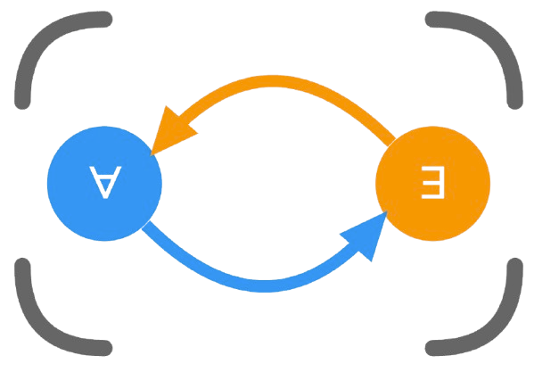

<div align="center">
    
    <h1 align="center">AF-XRAY</h1>
    <h3>Argumentation Framework eXplanation, Reasoning, and AnalYsis</h3>
</div>

<div align="center">

[](https://github.com/yilinxia/xray2.0)
[](LICENSE)
<!-- [](https://arxiv.org/abs/2025.12345)
[](https://doi.org/10.1145/3543873.3587362) -->

</div>

A modern web-based tool for visualizing and analyzing argumentation frameworks with interactive provenance tracking!

- 🎯 **Interactive Graph Visualization** 
- 🌐 **Multiple Semantics Support** 
- 📊 **Real-time Analysis** 
- 🔍 **Provenance Tracking**

## What is AF-XRAY?

AF-XRAY (Argumentation Framework eXplanation, Reasoning, and AnalYsis) is a JavaScript-based web application that brings interactive argumentation framework analysis to your browser. Developed with modern web technologies like Next.js, React, and Cytoscape.js, our tool enables researchers and practitioners to visualize, analyze, and understand complex argumentation frameworks through intuitive interactive interfaces.

## Local Deployment

### Installation

```bash
# Clone the repository
git clone https://github.com/yilinxia/xray2.0
cd xray2.0

# Install dependencies
npm install

# Start development server
npm run dev
```

Navigate to [http://localhost:3000](http://localhost:3000) to access the application.

## Usage

### Creating and Analyzing Frameworks

```javascript
// Example framework in JSON format
const framework = {
  "name": "Example Framework",
  "arguments": [
    {"id": "a", "annotation": "Argument A"},
    {"id": "b", "annotation": "Argument B"}
  ],
  "defeats": [
    {"from": "a", "to": "b"}
  ]
};

// Upload this framework to visualize and analyze
```

### Supported File Formats

**Text Format (.txt, .af):**
```
arg(a).
arg(b).
att(a,b).
```

**JSON Format (.json):**
```json
{
  "name": "Example Framework",
  "arguments": [
    {"id": "a", "annotation": "Argument A"},
    {"id": "b", "annotation": "Argument B"}
  ],
  "defeats": [
    {"from": "a", "to": "b"}
  ]
}
```

**Graphviz Format (.gv):**
```
digraph G {
  a -> b;
}
```

## Developing AF-XRAY

### Prerequisites
- Node.js 18+
- npm or yarn package manager

### Setup

```bash
# Clone the repository
git clone https://github.com/yilinxia/xray2.0
cd xray2.0

# Install dependencies
npm install

# Run tests
npm run test

# Start development server
npm run dev
```

### Project Structure

```
xray2.0/
├── app/                    # Next.js app directory
├── components/            # React components
│   ├── ui/               # Reusable UI components
│   ├── argument-graph.tsx # Main graph visualization
│   ├── semantics-panel.tsx # Semantics computation panel
│   └── json-editor.tsx   # Framework editor
├── lib/                  # Utility functions
│   ├── argumentation.ts  # Core argumentation logic
│   ├── types.ts          # TypeScript type definitions
│   └── utils.ts          # Utility functions
└── public/               # Static assets
```

## Citation

To learn more about AF-XRAY, check out our research paper published at ICAIL'25.

```bibtex
@inproceedings{xia2025afxray,
  title     = {AF-Xray: Visual Explanation and Resolution of Ambiguity in Legal Argumentation Frameworks},
  author    = {Yilin Xia and Heng Zheng and Shawn Bowers and Bertram Ludäscher},
  booktitle = {Proceedings of the Twentieth International Conference on Artificial Intelligence and Law (ICAIL 2025)},
  year      = {2025},
  pages     = {483--485},
  address   = {Chicago, IL, USA},
  publisher = {ACM},
  isbn      = {979-8-4007-1939-4}
}
```

## License

The software is available under the MIT License.

## Contact

If you have any questions, feel free to open an issue on GitHub.